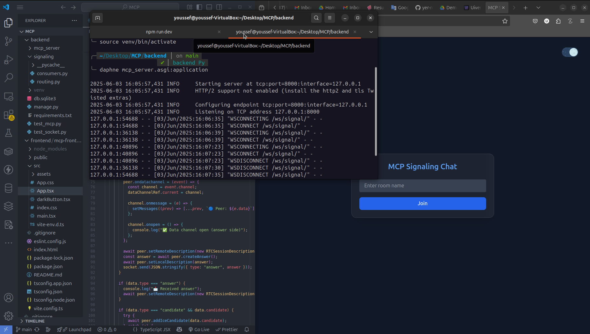

# 📡 MCP Signaling Server (Django + Channels + ASGI)

This is an asynchronous backend WebSocket signaling server built with Django and Channels, implementing a custom protocol called MCP (Message Context Protocol). It allows React frontend clients to exchange WebRTC signaling messages in real-time without using REST APIs.

---

## 🚀 Features

* ASGI-compliant Django server with real-time WebSocket support
* Custom signaling protocol: MCP (Message Context Protocol)
* Room-based signaling (multi-user capable)
* Supports `offer`, `answer`, `candidate`, and `leave` messages
* Works with any frontend WebRTC client (React, etc.)
* Includes test script for two-clients simulation

---

## 🧱 Project Structure

```
backend/
├── mcp_server/             # Django project
│   ├── settings.py         # ASGI + Channels config
│   └── asgi.py             # ASGI application
├── signaling/              # Signaling app
│   ├── consumers.py        # SignalConsumer logic
│   └── routing.py          # WebSocket routing rules
├── requirements.txt        # Python dependencies
├── manage.py               # Django CLI tool
├── test_mcp.py             # Python script to test with 2 clients
└── venv/                   # Virtual environment (not included in repo)
```

---

## ⚙️ Installation & Setup

1. **Clone the repo and enter backend folder:**

   ```bash
   git clone https://github.com/yer-retb/Asynchronous-MCP-Server-with-WebRTC-Signaling.git mcp-signaling-server
   cd mcp-signaling-server/backend
   ```

2. **Create and activate virtual environment:**

   ```bash
   python3 -m venv venv
   source venv/bin/activate
   ```

3. **Install dependencies:**

   ```bash
   pip install -r requirements.txt
   ```

4. **Apply migrations (optional if using Django admin):**

   ```bash
   python manage.py migrate
   ```

5. **Run the server using Daphne:**

   ```bash
   daphne mcp_server.asgi:application
   ```

   Server will be available at:

   * `http://127.0.0.1:8000`
   * WebSocket endpoint: `ws://127.0.0.1:8000/ws/signal/?room=ROOM_NAME`

---

## 🔁 MCP Protocol (Message Context Protocol)

### Supported Message Types

| Type        | Purpose                      |
| ----------- | ---------------------------- |
| `offer`     | Initial connection offer     |
| `answer`    | Response to the offer        |
| `candidate` | ICE candidate for connection |
| `leave`     | User leaves the session      |

### Example Message Formats

```json
// Offer
{ "type": "offer", "sdp": "..." }

// Answer
{ "type": "answer", "sdp": "..." }

// ICE Candidate
{ "type": "candidate", "candidate": "..." }

// Leave
{ "type": "leave" }
```

Clients send these messages through the WebSocket. The server forwards each message to all other peers in the same room.

---

## 🧪 Testing the Backend

Use the included script to test with 2 simulated clients:

```bash
python test_mcp.py
```

Expected output:

```
[Client1] Connected
[Client1] Sent offer
[Client2] Connected
[Client2] Received: {"type": "offer", "sdp": "fake-sdp-from-Client1"}
```

---

## 💡 Technical Decisions

* **Django Channels**: Built-in WebSocket support that works seamlessly with ASGI
* **Daphne**: Production-ready ASGI server compatible with Channels
* **In-memory rooms**: Kept simple using Python dictionaries for development
* **Room-based signaling**: Easier to scale, test, and organize peer communication

---


# 💬 MCP Frontend Client (React + TypeScript)

This is the frontend application for the **MCP (Message Context Protocol)** WebRTC signaling system. It connects to a Django ASGI backend via WebSockets and enables peer-to-peer communication through WebRTC DataChannels.

---

## 🚀 Features

* Room-based signaling with custom WebSocket protocol (MCP)
* Peer-to-peer messaging via WebRTC Data Channels
* Dynamic UI for joining rooms, sending messages, and monitoring peer presence
* Displays room name and real-time connection status
* Smooth transition animations and stateful room handling

---

## 📁 Project Structure

```
mcp-frontend/
├── public/                 # Static assets
├── src/                    # App source code
│   ├── App.tsx             # Main component logic
│   └── main.tsx            # React DOM mounting
├── index.html              # HTML entry
├── package.json            # Project metadata
└── vite.config.ts          # Vite config for TSX support
```

---

## ⚙️ Setup & Run

1. **Enter the mcp-frontend folder:**

   ```bash
   cd mcp-frontend
   ```

2. **Install dependencies:**

   ```bash
   npm install
   ```

3. **Start development server:**

   ```bash
   npm run dev
   ```

   App will run at: [http://localhost:5173](http://localhost:5173)

---

## 🔌 WebSocket Protocol (MCP)

The frontend communicates with the backend via WebSocket using a custom protocol:

```ts
const socket = new WebSocket(`ws://localhost:8000/ws/signal/?room=ROOM_NAME`);
```

* On connection, a WebRTC `RTCPeerConnection` is created
* A `DataChannel` named `chat` is established for P2P messaging
* All signaling messages (`offer`, `answer`, `candidate`) are exchanged via socket

---

## 💬 Messaging Flow

* User joins a room
* First user becomes offerer and opens DataChannel
* Second user responds and establishes P2P connection
* Messages are exchanged directly between peers

---

## 🛡️ Peer Limit Protection

Only **two peers** are allowed per room. When a third user attempts to join:

* The backend rejects the WebSocket connection
* The frontend detects and displays an error without rendering the chat interface

---

## 📹 Demo Video

[](https://drive.google.com/file/d/16pBCjq4vHJctinWHVDRJYTykVQXZg9uv/view?usp=drive_link)

> Click the thumbnail above to view the demo video on Google Drive